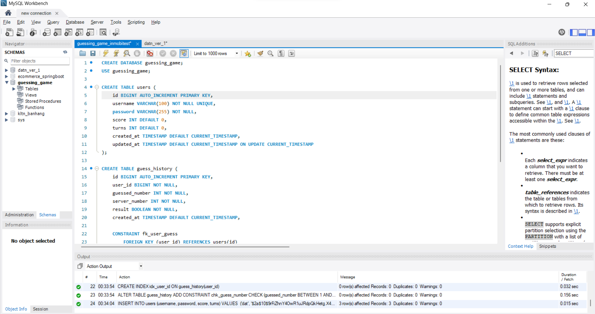

# Guessing Game_InmobiTest

Spring Boot REST API cho bài test Inmobi.

## Tech Stack

- Java 17
- Spring Boot 4
- Spring Security + JWT
- Spring Data JPA
- MySQL
- Validation + Lombok
- Swagger / OpenAPI v3
- Docker Compose

## Environment Variables

The app supports these environment variables:

- `SERVER_PORT=8080`
- `DB_HOST=localhost`
- `DB_PORT=3306`
- `DB_NAME=guessing_game`
- `DB_USERNAME=root`
- `DB_PASSWORD=123456`
- `JWT_SECRET=guessing-game-super-secret-key-for-jwt-2026`
- `JWT_EXPIRATION_MS=86400000`
- `GAME_WIN_PROBABILITY=0.05`
- `GAME_PURCHASE_TURNS=5`

## Run Locally

Start MySQL first, then run:

```bash
./mvnw spring-boot:run
```

API base URL:

```text
http://localhost:8080
```

## Swagger / OpenAPI

After the application starts:

- Swagger UI: `http://localhost:8080/swagger-ui.html`
- OpenAPI JSON: `http://localhost:8080/v3/api-docs`

Public endpoints:

- `POST /register`
- `POST /login`
- Swagger / OpenAPI endpoints

Protected endpoints use Bearer JWT in the `Authorization` header.

## Authentication Notes (JWT uses userId)

- This project uses **JWT Bearer** authentication.
- The token **subject (`sub`) is the `userId`**, not `username`/`email`. This makes authentication stable even if username/email changes later.
- Register/Login still accept `username` + `password`. The database also stores an `email` field; by default it is set to the same value as `username` unless you extend the register flow.

## Docker Compose

Build and run the full stack:

```bash
docker compose up --build
```

Minh họa chạy docker file:


This starts:

- `mysql` on host port `3307` by default
- `app` on host port `8080` by default

If `3307` or `8080` are not suitable, override them:

```powershell
$env:APP_HOST_PORT="8080"
$env:MYSQL_HOST_PORT="3306"
docker compose up --build
```

Stop the stack:

```bash
docker compose down
```

Stop and remove the database volume:

```bash
docker compose down -v
```

## Build And Test

```bash
./mvnw clean test
./mvnw clean package
```

Tests run with H2 in-memory database under the `test` profile.

## Database Script

If you want to initialize MySQL manually, use:

```text
guessing_game_inmobitest.sql
```

Current `users` table contains: `id, username, email, password, score, turns, created_at, updated_at`.

Sample users in the SQL script:

- `dat / 123456`
- `user1 / 123456`
- `user2 / 123456`

Database được sử dụng bằng Mysql:


## Main Endpoints

### Register

```bash
curl -X POST http://localhost:8080/register \
  -H "Content-Type: application/json" \
  -d "{\"username\":\"dat\",\"password\":\"123456\"}"
```

### Login

```bash
curl -X POST http://localhost:8080/login \
  -H "Content-Type: application/json" \
  -d "{\"username\":\"dat\",\"password\":\"123456\"}"
```

Response includes a JWT token:

```json
{
  "token": "<JWT>",
  "username": "dat"
}
```

### Buy Turns

```bash
curl -X POST http://localhost:8080/buy-turns \
  -H "Authorization: Bearer <TOKEN>"
```

### Guess

```bash
curl -X POST http://localhost:8080/guess \
  -H "Authorization: Bearer <TOKEN>" \
  -H "Content-Type: application/json" \
  -d "{\"number\":3}"
```

### Leaderboard

```bash
curl http://localhost:8080/leaderboard \
  -H "Authorization: Bearer <TOKEN>"
```

### Current User

```bash
curl http://localhost:8080/me \
  -H "Authorization: Bearer <TOKEN>"
```

Example `/me` response:

```json
{
  "username": "dat",
  "email": "dat",
  "score": 3,
  "turns": 7
}
```
